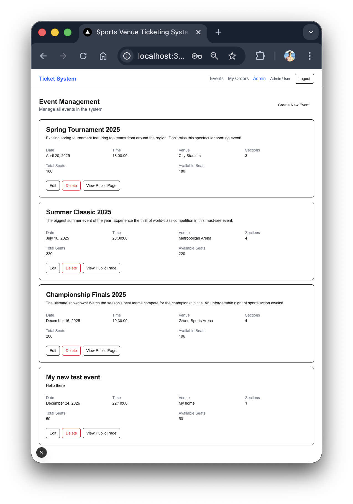

# Features

- Ticket reservation and purchase
- Admin event creation and reports
- User login with bcrypt password hashing
- Fully contained in docker, runs without any configuration, starts with example data

# AI use
Cline with Claude Sonnet 4.5 was used for aiding development, it was used by first writing precise instructions files and then running Claude in an agentic way

Memory and progress files were used to track tasks while maintaining a small context size

Almost all of the code was AI written, but some bugs required manual analysis to steer Claude in the correct direction

# Prioritization
I decided to prioritize both features and development time,
the project was finished in about 8 hours of half-time work, probably 4 hours of total continous work.

# Getting started

Run the following commands:
```
docker-compose build
docker-compose up
```

Open http://localhost:3000


## Login info:

|email|password|role
|-|-|-|
  |admin@venue.com|Admin123!|admin|
  |demo@example.com|Demo123!|customer|
  |test@example.com|Test123!|customer|


- Login with a "customer"
- Click "Browse events"


From here you can reserve and purchase tickets


You can test reservation locks with 2 browsers, the reservation
time is 10 seconds


## Admin

The admin has a dashboard with KPI and reports


You can also create new events:


